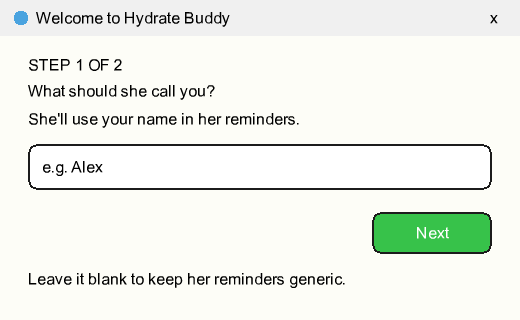
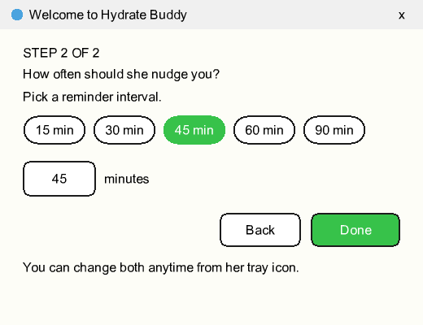

# 💧 Hydrate Buddy

A tiny **pixel-art desktop companion** who walks into the corner of your screen
every **45 minutes** (between **10:00 AM and 11:00 PM IST**) to remind you to
drink water — then celebrates when you do and quietly walks off.


- **YES, I DRANK** → she takes a sip, confetti celebration, and walks off. 🎉
- **SNOOZE** → *"I'll come back in 10 mins!"* and she returns in 10 minutes.
- **She greets you by name** and lets you **pick your reminder interval** — a
  quick 2-step welcome sets both up the first time you open her.
- The rest of the time she waits in your **system tray** — right-click it for
  **Drink now**, **Set up…**, **Set your name…**, **Reminder every X min**,
  **Pause**, or **Quit**.

Windows is fully supported (including launch-at-login). It also runs on macOS and
Linux — only the one-command auto-start setup is Windows-only there (see below).

---

## ⬇️ Download (easiest — no coding)

**Windows:** grab the installer from the
**[latest release](https://github.com/sharada-dev/hydrate-buddy/releases/latest)** →
download `HydrateBuddy-Setup-*.exe` and double-click it.

> Windows SmartScreen may warn *"Windows protected your PC"* because the app
> isn't code-signed. Click **More info → Run anyway** — it's a normal unsigned
> indie app. The installer adds Desktop and Start Menu shortcuts; open
> **Hydrate Buddy** and you're set. Right-click the tray icon → **Start at login**
> to have her start with Windows.

On macOS/Linux, use the "Run from source" steps below.

---

## 👋 First launch

The first time you open her, a quick **2-step welcome** gets you set up — your
name, then how often she should nudge you:

<p align="center">
  
  
</p>

That's it — she then walks in and greets you **by name**. You can change either
later, anytime, from her **tray icon** (right-click → *Set your name…* or
*Reminder every X min*).

> **Upgrading from an older version and don't see the welcome?** That's expected —
> Windows keeps your settings between installs, so she remembers she already
> greeted you and skips it. Just right-click her **tray icon → _Set up…_** to
> reopen the welcome wizard anytime (or set your name and interval directly from
> that same menu).

---

## 🧑‍🤝‍🧑 Choose your character

Right-click the tray icon → **Change character…** and tap a card to switch
instantly — or bring your own two poses (the app cuts out the background for you):

<p align="center">
  
  &nbsp;&nbsp;&nbsp;&nbsp;&nbsp;
  
</p>

<p align="center"><i>Business woman &nbsp;•&nbsp; Business man — and more can be added anytime.</i></p>

---

## 🧑‍💻 Run from source (developers / customising)

### 1. Install Node.js (one time)

If you don't already have it, download the **LTS** version from
[nodejs.org](https://nodejs.org) and install it (just click through the
installer). To check it worked, open a terminal (PowerShell / Command Prompt on
Windows) and run:

```bash
node --version
```

You should see a version number like `v20.x` or higher.

### 2. Get the code

Either **download the ZIP** from the green **Code** button on GitHub and unzip
it, **or** clone it:

```bash
git clone https://github.com/sharada-dev/hydrate-buddy.git
cd hydrate-buddy
```

### 3. Install and run

```bash
npm install    # one-time: downloads Electron (~100 MB, be patient)
npm start      # launch Hydrate Buddy
```

The first reminder pops up a few seconds after launch so you can see the whole
flow; after that she keeps to the normal 45-minute schedule.

---

## 🔁 Make her start automatically at login

**Windows** — one command:

```bash
npm run autostart:enable     # start with Windows every time you log in
npm run autostart:disable    # stop auto-starting
```

This drops a small, silent launcher into your Startup folder that points at your
copy of the app. (Keep the `hydrate-buddy` folder where it is after enabling —
the launcher references it by path.)

**macOS** — System Settings → General → **Login Items** → **+**, or add a
LaunchAgent.
**Linux** — add a `.desktop` file to `~/.config/autostart/`.

---

## ⚙️ Make it yours

**Reminder interval** — right-click the tray icon → **Reminder every X min** →
pick **15 / 30 / 45 / 60 / 90** minutes, or **Custom…** for any value (1–720 min).
No code needed; it's saved per-user.

**Other timing** — edit the constants at the top of [`main.js`](main.js):

| Setting                | What it does                          | Default |
| ---------------------- | ------------------------------------- | ------- |
| `ACTIVE_START_HOUR`    | First hour reminders may appear (IST) | `10`    |
| `ACTIVE_END_HOUR`      | Reminders stop after this hour (IST)  | `23`    |
| `DEFAULT_INTERVAL_MIN` | Default minutes between reminders     | `45`    |
| `SNOOZE_MIN`           | Snooze length in minutes              | `10`    |

> Times are computed in **IST (Asia/Kolkata)** no matter what your computer's
> timezone is. Living elsewhere? Change `'Asia/Kolkata'` in `nowIST()` inside
> `main.js` to [your timezone](https://en.wikipedia.org/wiki/List_of_tz_database_time_zones).

**Your name** — the first time you open her she'll ask your name so she can greet
you personally (*"Alex, time to drink water…"*). Change it anytime from the tray
icon → **Set your name…**, or leave it blank to keep reminders generic. Your name
is stored only in your own machine's app-data folder — never in this repo.

**Messages** — the reminder and cheer lines live in `promptFor` / `cheerFor` in
[`renderer/renderer.js`](renderer/renderer.js).

**Character size / position** — tweak `#pet` (size) and the window size
constants in `main.js`.

**Pick a character** — right-click the tray icon → **Change character…** to open
the gallery, then tap **Business woman** or **Business man** to switch instantly.
Saved per-user.

**Bring your own** — in that same window you can instead pick two still images (a
**standing** pose and a **drinking** pose); the app **cuts out the background for
you** and swaps her in. No code needed.

> 💡 No art skills? The [**Make your own character** guide](docs/make-your-own-character.md)
> has copy-paste AI prompts for generating two matching poses. Works best on a
> **plain, solid-colour background**.

*Adding a bundled preset (for everyone)?* Drop `idle.png` + `drinking.png` into
`assets/characters/<name>/raw/`, run `npm run prepare-assets` to cut them out, and
add the character to the `PRESETS` list in `main.js`. (The default pair lives in
`assets/raw/` → `npm run prepare-assets` regenerates it and `assets/tray.png`.)

---

## 🎨 New to code? Make her your own — step by step

Never touched code before? No problem. You can change her reminder timing or swap
in a completely different character (a guy, a cat, literally anyone) without
knowing how to program — you're just editing a couple of labelled lines and
dropping in some images. About 10 minutes.

**You'll need:** a Windows PC and [Node.js](https://nodejs.org) — download the
**LTS** version and click through the installer.

### 1. Get your own copy of the code
On the [repo page](https://github.com/sharada-dev/hydrate-buddy), click the green
**Code** button → **Download ZIP**, then unzip it somewhere easy like your Desktop.
*(Optional: click **Fork** first if you want your own copy saved on GitHub.)*

### 2. Open a terminal in that folder
Open the unzipped `hydrate-buddy` folder in File Explorer. Click the **address bar**,
type `powershell`, and press **Enter** — a terminal opens already pointing at the
folder. Run this once to set things up:

```bash
npm install
```

### 3. Make your change

**➡️ To change the timing:** open `main.js` in any text editor (Notepad works;
[VS Code](https://code.visualstudio.com) is free and nicer). Near the top, edit
these labelled lines and **save**:

```js
const INTERVAL_MIN = 45;      // minutes between reminders — change 45 to whatever
const ACTIVE_START_HOUR = 10; // first hour she reminds you (24-hour clock)
const ACTIVE_END_HOUR = 23;   // she goes quiet after this hour
```

**➡️ To swap the character** (e.g. a male version): you need **two images** of your
character on a **plain, solid-colour background**:
- a **standing** pose → save it as `assets/raw/idle.png`
- a **drinking/sipping** pose → save it as `assets/raw/drinking.png`

Easiest way to make them: follow the
[**Make your own character** guide](docs/make-your-own-character.md) — it has
copy-paste AI prompts (ChatGPT, Gemini, etc.) for two matching poses. Then run:

```bash
npm run prepare-assets
```

That auto-removes the background and preps her sprites.

### 4. See it live

```bash
npm start
```

She pops up with your changes. Tweak and re-run until it feels right.

### 5. (Optional) Make your own installer to share

Want a `.exe` of *your* version to send around?

```bash
npm run make-icon   # refresh the app icon from your new character (optional)
npm run dist        # builds your installer into the dist/ folder
```

That's it — you've made your own Hydrate Buddy. 🎉 The
[settings table above](#️-make-it-yours) lists everything you can tweak.

---

## 📦 Build the installer yourself

Want to produce your own `.exe` (e.g. after changing the art or messages)?

```bash
npm run make-icon    # regenerate the app icon from assets/idle.png (optional)
npm run dist         # builds dist/HydrateBuddy-Setup-<version>.exe
```

The installer is unsigned, so recipients will see the SmartScreen "Run anyway"
prompt. To bump the version, edit `version` in `package.json` before building.

---

## 🚀 Releasing a new version (maintainers)

Publishing a new installer is **one push**. A
[GitHub Action](.github/workflows/release.yml) builds the Windows installer and
attaches it to a release automatically whenever you push a version tag:

```bash
# bump the version in package.json, commit, tag, and push in one go:
npm version patch      # 1.0.0 -> 1.0.1 (creates a commit + git tag)
git push --follow-tags
```

Or tag manually:

```bash
git tag v1.0.1
git push origin v1.0.1
```

Within a few minutes the new **`HydrateBuddy-Setup-<version>.exe`** appears on the
[Releases page](https://github.com/sharada-dev/hydrate-buddy/releases) — no local
build needed.

---

## 🩹 Troubleshooting

- **`npm` not recognised** → Node.js isn't installed or the terminal was open
  before installing it. Install Node, then open a **new** terminal.
- **`npm install` is slow / stalls** → it's downloading Electron; give it a
  minute on a decent connection.
- **She never appears** → make sure the current time is within the active hours
  (10:00–23:00 IST by default), or right-click the tray icon → **Drink now**.
- **Character looks like a rectangle** → run `npm run prepare-assets` to
  re-cut the background from the art.

---

## 🛠️ How it works

- **[Electron](https://www.electronjs.org/)** — a transparent, always-on-top,
  frameless window plus a system-tray icon.
- **[jimp](https://github.com/jimp-dev/jimp)** — flood-fills the flat background
  out of the source art at setup time to make transparent sprites.
- No accounts, no network calls, no tracking — everything runs locally on your
  machine.

## 📄 License

[MIT](LICENSE) — free to use, share, and modify.
